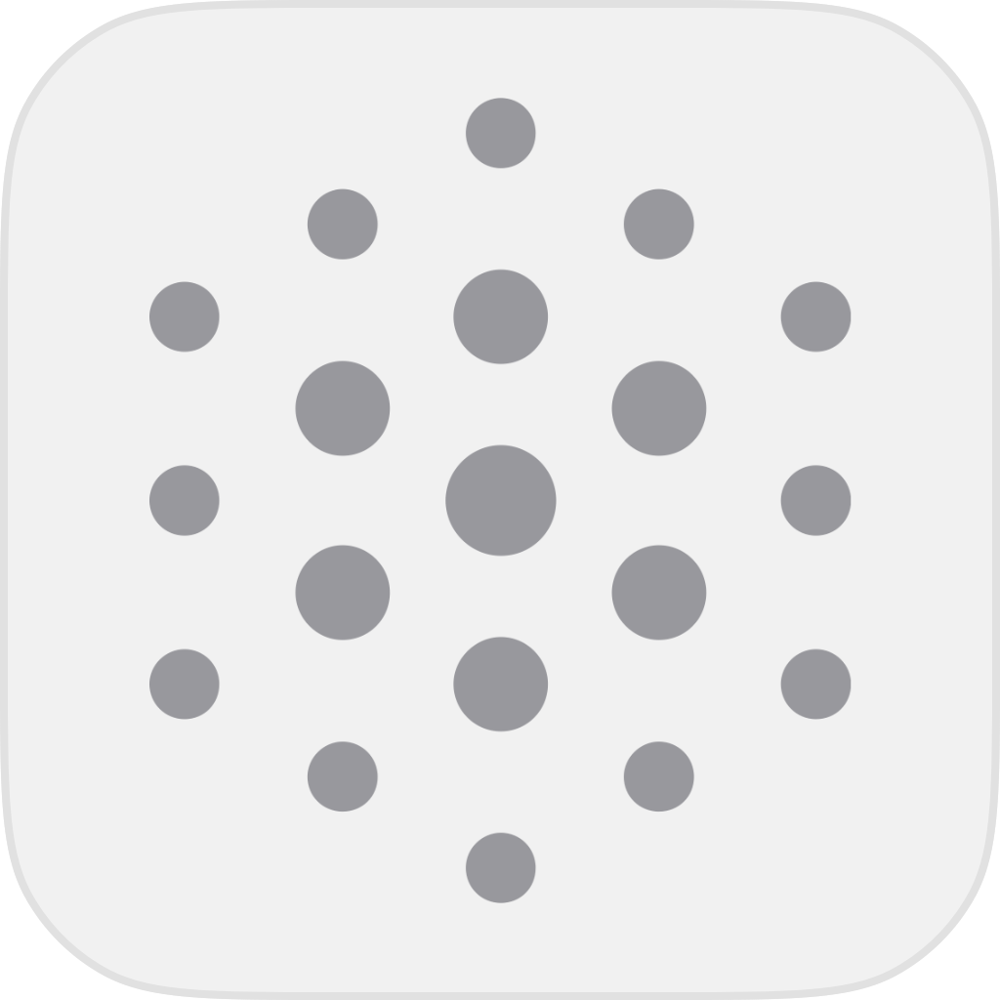

  
   
  <h3 align="center">Nano</h3>
  
A collection of various aspects of Apple platform development.

## Table of Contents

- [Overview](#overview)
- [Tasks](#tasks)
- [Bots](#bots)
- [Roadmap](#roadmap)

## Overview

A collection of various aspects of Apple platform development.

Tasks and bots form a key part of the architecture. These are designed to automate and simplify various aspects of development, testing, and deployment.

## Tasks

- Tasks leverage `go-task` (https://taskfile.dev) to run commands.
- Tasks are defined to run commands at different levels within the repository hierarchy.
- They can be found in `.nano/Tasks` directories.

## Bots

- These are a collection of tools to perform various operations.
- They can be found in `.nano/Bots` directories.
- Bots can be run independently or via tasks.
- Current bots include:
  - Audit: Focused on analyzing project architecture. (Work in Progress)
  - MockData: Generates mock data for testing and development purposes. (Work in Progress)
  - TokenCount: Counts the number of tokens for a given scope to ensure optimal size for AI/ML models. (Work in Progress)

## Roadmap

- Utilize the Pkl configuration language (https://pkl-lang.org/) for more flexible and dynamic task definitions in YAML.
- Planned bots:
  - DependencyGraph: Generates dependency graphs.
  - DocGen: Automatic generation of documentation.
  - UMLGen: Generates UML diagrams.
